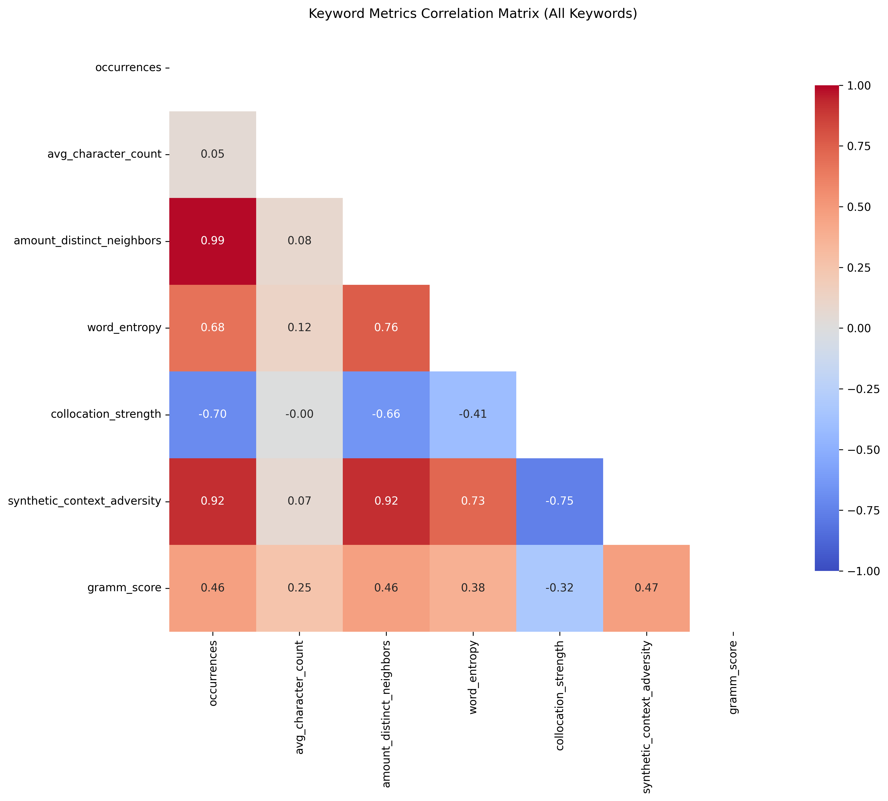
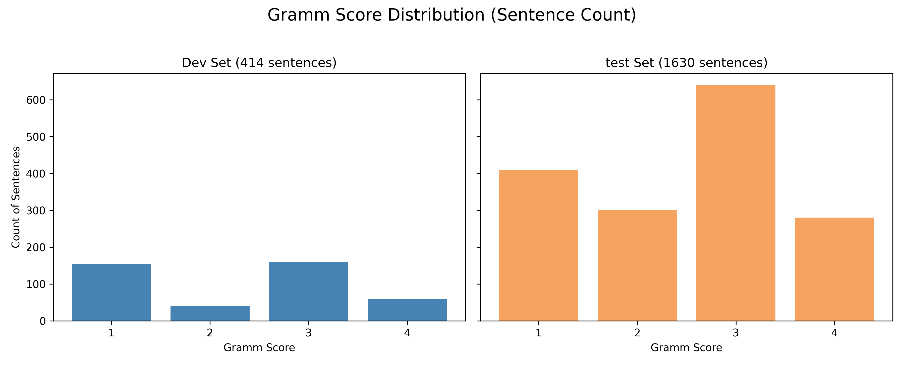

# LLMs-for-Classification-of-Grammaticalization-Degrees

This repository provides state-of-the-art experiments and resources for classifying grammaticalization degrees using Large Language Models (LLMs). Grammaticalization, the linguistic process by which words develop into grammatical elements, poses significant challenges for traditional computational methods. Leveraging powerful language models, this project aims to provide a nuanced understanding and automatic classification of different grammaticalization stages.

---

## 📂 Project Structure & Files

The project consists of several main steps and data components:

### 🔧 Dataset Preprocessing

We process large-scale corpora to extract meaningful features related to grammaticalization.

* **Keyword Ground Truth:**

  * File: [`data/keyword_groundtruth.csv`](data/keyword_groundtruth.csv)
  * Contains two columns: `keyword` and `grammaticalization_level`

* **Raw Corpus Data:**

  * Source: [SdeWaC Corpus](https://www.ims.uni-stuttgart.de/en/research/resources/corpora/sdewac/)
  * Size: Approx. 25 GB of German text data (SDE-WRC-Version-3)

* **Keyword Metrics:**

  * File: [`data/keywords_metrics.csv`](data/keywords_metrics.csv)
  * Includes calculated metrics like:

    * `Occurrences`
    * `Average Character Count`
    * `Amount Distant Neighbors`
    * `Word Entropy`
    * `Collocational Strength`
    * `Synthetic Context Adversity`
    * `Grammaticalization Score`
  * Explanation: [`wiki/metrics_explanation.md`](wiki/metrics_explanation.md)

* **Metric Correlation Plot:**

  * Image: 

### 📊 Data Splits & Example Sentences

We split the data for evaluation and development:

* **Dev/Test Splits:**

  * 20% dev set for prompt engineering: [`data/data_dev.jsonl`](data/data_dev.jsonl)
  * 80% test set for final evaluation: [`data/data_test.jsonl`](data/data_test.jsonl)

* **Score Distribution Plot:**

  * Image: 

### 📈 Evaluation

Evaluation metrics include correlation and average precision and are calculated using the full corpus and all keywords.

* **Summary Table:** [`data/evaluation_all_keywords_full_corpus.csv`](data/evaluation_all_keywords_full_corpus.csv)

### 🔍 Leak Checks

We are conducting checks to identify any potential overlap between training data and our evaluation set.

* See folder: [`leak_check`](leak_check)

---

## 👥 Contributors

* **Prasanna Bhat** ([prasanna.bhat@utn.de](mailto:prasanna.bhat@utn.de)), University of Technology Nuremberg, Germany
* **Divyansh Kaushik** ([divyansh.kaushik@utn.de](mailto:divyansh.kaushik@utn.de)), University of Technology Nuremberg, Germany
* **Luca Burghard** ([luca.burghard@utn.de](mailto:luca.burghard@utn.de)), University of Technology Nuremberg, Germany
* **Dominik Schlechtweg** ([dominik.schlechtweg@gmx.de](mailto:dominik.schlechtweg@gmx.de)), University of Stuttgart, Germany
* **Anne Breitbarth** ([anne.breitbarth@ugent.be](mailto:anne.breitbarth@ugent.be)), Ghent University, Belgium

---

## 📄 License

Distributed under the MIT License. See `LICENSE` file for more information.
