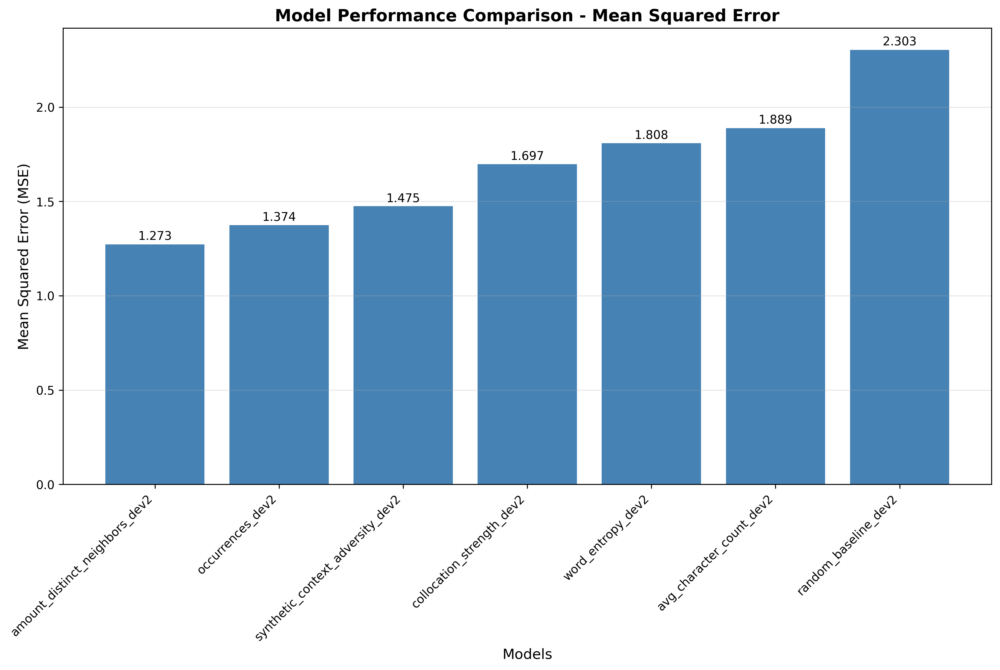

# Evaluation

## Setup Instructions

If you have any results from any technique like few-shot prompting, baseline-prompt, or any other method, please add them to the `evaluation/input_csv/` directory.
Please add only CSV files that contain only, but all keywords from the dev2 set that are formatted as follows:

```csv
keyword,gramm_score,prediction
example_word,4,4
another_word,3,4
test_word,1,2
```

For reference, see `evaluation/input_csv/random_baseline_dev2.csv`.

## File Requirements

- CSV format with comma delimiters
- Required columns: `keyword`, `gramm_score`, `prediction`
- First row should contain column headers
- Only dev2 dataset files should be placed in `evaluation/input_csv/`
- Files name needs to be enough to know what was done. Use numbers, descriptive names or whatever, you can also add a legend in the readme if you want to explain the files.

e.g. if you have a file that contains results from few-shot using llama3.1 name it `few_shot_llama3.1_dev2.csv`.

## Run the Evaluation script

The script will read all CSV files in the `evaluation/input_csv/` directory and evaluate and make a new plot like that, as well as a new CSV file with the results in the [evaluation/evaluation_results.csv](evaluation/evaluation_results.csv) file.



